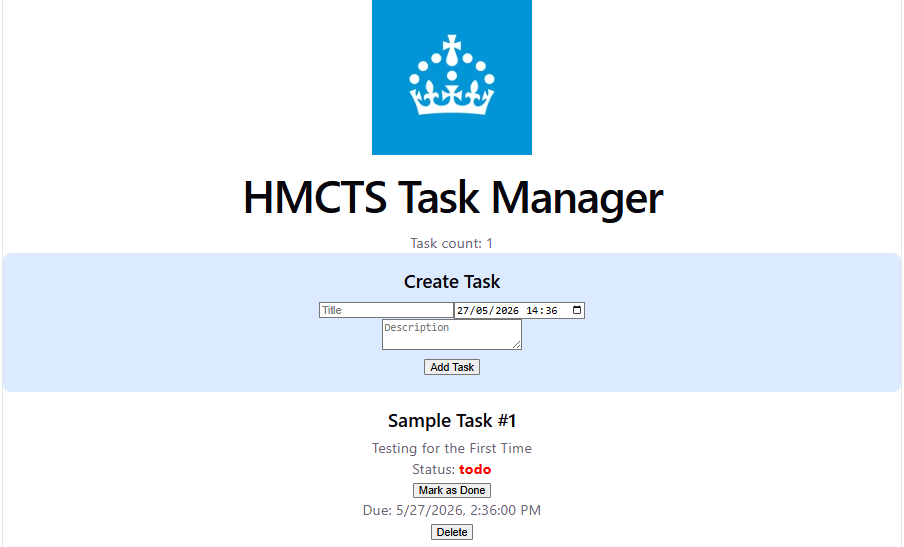

## Project Overview



This application was developed as part of the HMCTS DTS Developer Technical Test.

The goal was to build a full-stack task management system allowing caseworkers to efficiently manage tasks through a REST API and React frontend.

## Features

- Create tasks
- Retrieve all tasks
- Retrieve a task by ID
- Update task status
- Delete tasks
- Due date/time support
- Persistent MongoDB database storage
- Basic validation and error handling

## Architecture

- React frontend built with Vite
- Express REST API backend
- MongoDB Atlas database
- Mongoose ODM for database interaction

## Tech Stack

Frontend:
- React
- Vite

Backend:
- Node.js
- Express
- MongoDB Atlas
- Mongoose

## Setup instructions:


### Backend

```bash
cd server
npm install
npm run dev
```

The backend uses nodemon for automatic server restarting during development

---

### Frontend

```bash
cd client
npm install
npm run dev
```


Backend runs on:

http://localhost:3000

Frontend runs on:

http://localhost:5173


## API Endpoints

### Get all tasks

GET `/api/tasks`

Returns all tasks.

Response:

```json
[
  {
    "_id": "123",
    "title": "example",
    "status": "todo"
  }
]
```

---

### Get task by ID

GET `/api/tasks/:id`

Returns a single task.

---

### Create task

POST `/api/tasks`

Request body:

```json
{
  "title": "Prepare report",
  "description": "Review documents",
  "status": "todo",
  "dueDate": "2026-05-25T10:00"
}
```

---

### Update task status

PATCH `/api/tasks/:id`

Request body:

```json
{
  "status": "done"
}
```

---

### Delete task

DELETE `/api/tasks/:id`

## Unit Testing

Basic unit tests were implemented using Jest to verify isolated application logic and demonstrate testing setup/configuration.


## Running Tests

Backend unit tests are implemented using Jest.

Run tests with:

```bash
cd server
npm test
